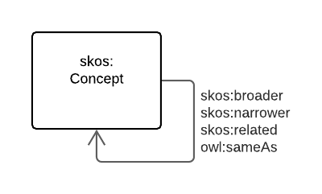
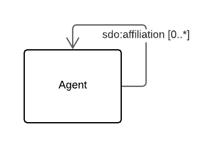

# NVS Vocabulary Profile

## Table of Contents

[Metadata](#metadata)  
[Abstract](#abstract)  
[Namespaces](#namespaces)  
[1. Introduction](#1-introduction)  
[2. Requirements](#2-requirements)  
[3. References](#3-references)  

## Metadata
* **URI**:
    * <https://w3id.org/profile/nvsvoc/specification>
* **Title**:
    * NVS Vocabulary Profile - Specification Document
* **Definition**:
    * This resource described, in human-readable terms, the requirements data must meet to adhere to this Profile
* **Created**:
    * 2020-09-16
* **Modified**:
    * 2020-09-16
* **Creator**:
    * [British Oceanographic Data Centre](https://www.bodc.ac.uk) 
* **Publisher**:
    * [British Oceanographic Data Centre](https://www.bodc.ac.uk) 
* **Further metadata**:
    * This specification document is part of the [NVS Vocabulary Profile](https://w3id.org/profile/nvsvoc). See that profile's main document for License & Rights information and other metadata not given here.
* **Profile URI**:
    * <https://w3id.org/profile/nvsvoc>

## Abstract
This is the specification document of the [BODC](https://www.bodc.ac.uk)'s profile of the *Vocabulary Publications Profile*. It defines, in natural language, the requirements that data must satisfy to be considered conformant with this profile.

This specification is not to be used for testing conformance of RDF resources to this profile. That role belongs to the validation resource within this profile:

* <https://w3id.org/profile/nvsvoc/validation>

For the list of all resources within this profile, see the profile definition:

* <https://w3id.org/profile/nvsvoc>

## Namespaces

* **dcterms**
    * <http://purl.org/dc/terms/>
* **iso**
    * <http://www.isotc211.org/schemas/grg/>
* **pav**
    * <http://purl.org/pav/>    
* **prof**
    * <http://www.w3.org/ns/dx/prof/>
* **prov**
    * <http://www.w3.org/ns/prov#>
* **reg**
    * <http://purl.org/linked-data/registry#>    
* **sdo**
    * <https://schema.org/>
* **skos**
    * <http://www.w3.org/2004/02/skos/core#>
* **rdfs**
    * <http://www.w3.org/2000/01/rdf-schema#> 
* **vocpub**
    * <https://w3id.org/profile/vocpub/>     

### Diagram Key
Diagrams in this Specification use the elements shown in Figure 1.

  
**Figure 1:** Diagram Elements Key

## 1. Introduction
The [British Oceanographic Data Centre (BODC)](https://www.bodc.ac.uk) defines a vocabulary as a controlled collection of defined terms that may or may not contain relationships between terms and relationships to terms in other vocabularies. 

The BODC uses the Simple Knowledge Organization System Reference (SKOS)[SKOS-REF] to structure their vocabularies and properties from a number of other ontologies (DCTERMS[DCTERMS], PAV[PAV]) to describe vocabulary elements and their relations.

This document is a profile of the *Vocabulary Publications Profile*[VOC-PUB] and by profile, the definition of *Profile* from the Profiles Vocabulary[PROF] is used. A profile is: 

> A specification that constrains, extends, combines, or provides guidance or explanation about the usage of other specifications. 

In the next section, this document describes how vocabulary elements must be presented to conforms to this profile. 

## 2. Requirements

### 2.1 Vocabulary
From the SKOS Primer[SKOS-PRIMER]:

> concepts usually come in carefully compiled vocabularies, such as thesauri or classification schemes

> SKOS makes it possible to define meaningful groupings or "collections" of concepts

NVS vocabularies are most commonly represented as `skos:Collection` objects but there are also `skos:ConceptScheme` objects used to present Concept hierarchies. Some requirements pertain to vocabularies of both Collection & ConceptScheme types, others just one or the other form. When pertaining to both, the requirements reads as for *vocabularies*. When for either Collections or ConceptSchemes, the relevant class name is used.

##### 2.1.1 Vocabulary URI: 
Each Vocabulary *MUST* be identified by a URI

  
**Figure 2:** Vocabulary identifiers

##### DRAFT: 2.1.2 Vocabulary identifiers
Each Vocabulary *MAY* indicate non-URI identifiers using the `dcterms:identifier` property with a string value or a datatype value specialising xsd:string

  
**Figure 3:** Vocabulary labels and definition

##### DRAFT: 2.1.3 Vocabulary preferred labels
Each Vocabulary *MUST* have one and only one `skos:prefLabel` property per language indicating a string value

##### DRAFT: 2.1.4 Vocabulary alternate labels
Each Vocabulary *MAY* have any number of `skos:altLabel` properties indicating string values and, if it does, the each must indicate its language

##### DRAFT: 2.1.5 Vocabulary definition:
Each Vocabulary *MAY* have `skos:definition` properties indicating string values and, if it does, it *MUST* only have one per language

  
**Figure 4:** Vocabulary dates

##### DRAFT: 2.1.6 Vocabulary modified date:
Each Vocabulary *MUST* have one and only one `dcterms:modified` property indicating an `xsd:date` or `xsd:dateTime` value

##### DRAFT: 2.1.7 Vocabulary created date:
Each Vocabulary *MAY* have at most one `dcterms:created` property indicating an `xsd:date` or `xsd:dateTime` value

  
**Figure 5:** Vocabulary versions

##### 2.1.8 Vocabulary current version:
Each Vocabulary *MUST* have one and only one `pav:hasCurrentVersion` property indicating a URI or one and only one `dcterms:isVersionOf` property indicating a URI

##### 2.1.9 Vocabulary past versions:
Each Vocabulary *MAY* have any number of `pav:hasPreviousVersion` properties indicating URI of other Concept istances

##### 2.1.10 Vocabulary version info:
Each Vocabulary *MUST* have one and only one `owl:versionInfo` property indicating a string range value or a datatype value specialising xsd:string

  
**Figure 6:** Vocabulary members & membership

##### DRAFT: 2.1.11 Collection members:
Collection *MUST* indicate their Concept members using the `skos:member` property

##### DRAFT: 2.1.12 ConceptScheme members:
ConceptSchemes *MUST* indicate the top Concept instances within their concept hierarchy using the `skos:hasTopConcept` property

##### DRAFT: 2.1.13 Vocabulary Dataset membership:
Each Vocabulary *MUST* indicate their membership of the NVS vocabularies dataset by use of the `void:inDataset` property indicating the URI <http://vocab.nerc.ac.uk/dataset/vocabs>

  
**Figure 7:** Vocabulary status

##### DRAFT: 2.1.14 Vocabulary status:
Each Vocabulary *MUST* indicate their status by using one and only one `meta:status` property indicating an *Register Item status value Vocabulary*[STAT-VOC] Concept 

  
**Figure 8:** Vocabulary agents

##### DRAFT: 2.1.15 Concept registry details:
Each Vocabulary *MUST* indicate one and only one Creator, Registry Manager & Registry Owner using the properties `dcterms:creator`, `iso:RE_RegisterManager` & `iso:RE_RegisterOwner` respectively, indicating Agent URIs

### 2.2 Concept
From the SKOS Primer[SKOS-PRIMER]:

> The fundamental element of the SKOS vocabulary is the concept. Concepts are the units of thought — ideas, meanings, or (categories of) objects and events—which underlie many knowledge organization systems 

NVS vocabulary concepts are `skos:Concept` instances and have SKOS objects and datatype properties as well as properties from several other ontologies.

##### 2.2.1 Concept URI:
Each Concept *MUST* be identified by a URI

  
**Figure 9:** Concept identifiers

##### 2.2.2 Concept identifiers:
Non-URI identifiers for a Concept *MAY* be communicated using `skos:notation`, `dc:identifier` or `dcterms:identifier` properties with a string range value or a datatype value specialising xsd:string

##### DRAFT: 2.2.2 Concept identifiers:
Non-URI identifiers for a Concept *MAY* be communicated using the `dcterms:identifier` property with a string range value or a datatype value specialising xsd:string

  
**Figure 10:** Concept labels & definition

##### 2.2.3 Concept preferred labels:
Each Concept *MUST* have one and only one `skos:prefLabel` property per language

##### 2.2.4 Concept alternate labels:
Each Concept *MAY* have any number of `skos:altLabel` properties and, if it does, the property must indicate its language

##### 2.2.5 Concept definition:
Each Concept *MAY* have `skos:definition` properties and, if it does, it may *MUST* only have one per language

  
**Figure 11:** Concept dates

##### DRAFT: 2.2.6 Concept modified date:
Each Concept *MUST* have one and only one `dcterms:modified` property indicating an `xsd:date` or `xsd:dateTime` value

##### DRAFT: 2.2.7 Concept created date:
Each Concept *MAY* have at most one `dcterms:created` property indicating an `xsd:date` or `xsd:dateTime` value

  
**Figure 12:** Concept version links

##### 2.2.8 Concept current version:
Each Concept *MUST* have one and only one `pav:hasCurrentVersion` property indicating a URI or one and only one `dcterms:isVersionOf` property indicating a URI

##### 2.2.9 Concept past versions:
Each Concept *MAY* have any number of `pav:hasPreviousVersion` properties indicating URI of other Concept instances

##### 2.2.10 Concept version info:
Each Concept *MUST* have one and only one `owl:versionInfo` property indicating a string range value or a datatype value specialising xsd:string

  
**Figure 13:** Concept membership

##### DRAFT: 2.2.11 Concept Collection membership:
Each Concept *MUST* indicate its membership within one and only one Collection by use of the `dcterms:isPartOf` property

##### DRAFT: 2.2.12 Concept ConceptScheme membership:
Each Concept *MAY* indicate its membership within Concept Schemes and, if they do, must use either the `skos:topConceptOf`  or `skos:inScheme` properties

##### DRAFT: 2.2.13 Concept Dataset membership:
Each Concept *MUST* indicate their membership of the NVS vocabularies dataset by use of the `void:inDataset` property indicating the URI <http://vocab.nerc.ac.uk/dataset/vocabs>

  
**Figure 14:** Concept relations

##### 2.2.14 Concept relations:
Each Concept *MAY* indicate their relation to other Concept instances by use of `skos:broader`, `skos:narrower`, `skos:related`, `owl:sameAs`

  
**Figure 15:** Concept status

##### DRAFT: 2.2.15 Concept status:
Each Concept *MUST* indicate their status by using one and only one `meta:status` property indicating an *Register Item status value Vocabulary*[STAT-VOC] Concept 

### DRAFT: 2.3 Agent 

##### DRAFT 2.3.1. Agent URI:
Each Agent instance *MUST* be identified by a URI

  
**Figure 16:** Agent type

##### DRAFT 2.3.2. Agent types:
Each Agent reference by a Vocabulary or a Concept *MUST* indicate that its type is either a Person or an Organisation using `sdo:Person` or `sdo:Organization` classes

  
**Figure 17:** Agent affiliation

##### DRAFT 2.3.3. Agent affiliation:
Each Agent affiliation *MUST* be indicated using the `sdo:affiliation` property indicating a URI of another Agent

  
**Figure 18:** Agent name

##### DRAFT 2.3.4. Agent name:
Each Agent *MUST* indicate its name using the property `sdo:name` indicating a string value

## 3. References
* **DCTERMS**
    * DCMI Usage Board. *DCMI Metadata Terms*. 2020-01-20. DCMI. URL: <https://www.dublincore.org/specifications/dublin-core/dcmi-terms/>
* **PAV**
    *  Paolo Ciccarese & Stian Soiland-Reyes. *PAV - Provenance, Authoring and Versioning*. <http://www.mindinformatics.org/>. URL: <https://pav-ontology.github.io/pav/>   
* **PROF**
    * Rob Atkinson; Nicholas J. Car (eds.). *The Profiles Vocabulary*. 18 December 2019. W3C Working Group Note. URL: <https://www.w3.org/TR/dx-prof/>
* **SKOS-REF**
    * Alistair Miles; Sean Bechhofer (eds.). *SKOS Simple Knowledge Organization System Reference*. 18 August 2009. W3C Recommendation. URL: <https://www.w3.org/TR/skos-reference/>
* **SKOS-PRIMER**
    * Antoine Isaac; Ed Summers (eds.). *SKOS Simple Knowledge Organization System Primer*. 18 August 2009. W3C Note. URL: <https://www.w3.org/TR/skos-primer/>
* **STAT-VOC**
    * Open Geospatial Consortium. **. 5th July 2020. SKOS Vocabulary. URL: <http://www.opengis.net/def/status>
* **VOC-PUB**
    * SURROUND Australia Pty Ltd. *Vocabulary Publication Profile*. 24th August 2020. Published Profile. URL: <https://w3id.org/profile/vocpub>
